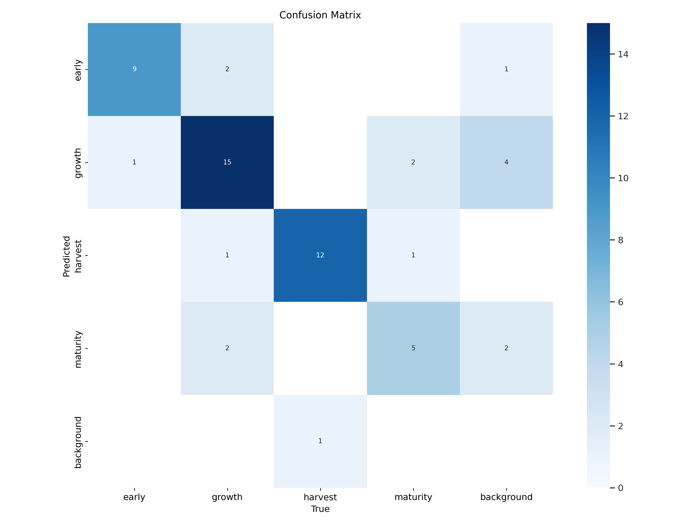
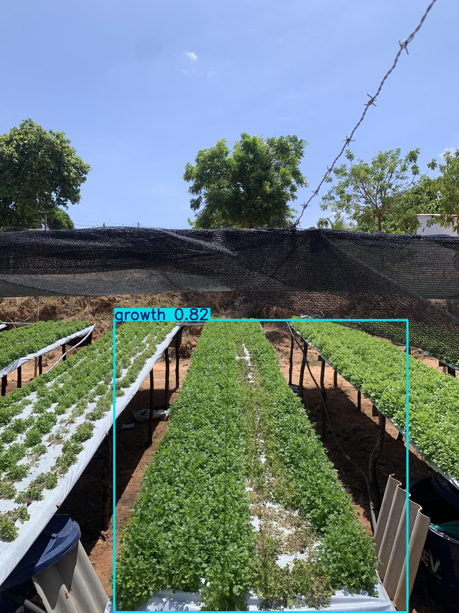

# Plant-Harvest 🌱🚜

AI-driven smart agriculture system using YOLO to detect plant growth stages, plant health, and optimal harvest timing.

This repository contains an example Colab notebook (plant-predict.ipynb), dataset layout, training code and exported model checkpoints for detecting plant stages: `early`, `growth`, `harvest`, and `maturity`.

---

## Table of contents
- [Overview](#overview)
- [Quick start (Colab / Local) 🧭](#quick-start-colab--local-)
- [Dataset structure 📁](#dataset-structure-)
- [Training example ⚙️](#training-example-)
- [Validation & Results 📈](#validation--results-)
- [Inference example ▶️](#inference-example-)
- [Images in repo 🖼️](#images-in-repo-)
- [Troubleshooting & notes ⚠️](#troubleshooting--notes-)
- [Tips to improve performance 💡](#tips-to-improve-performance-)
- [Files produced by training ✅](#files-produced-by-training-)
- [License & Contact ✉️](#license--contact-)

---

## Overview
Plant-Harvest uses Ultralytics YOLO to classify plant growth stages from images to help automate monitoring and decision-making (e.g., when to harvest). The included Colab notebook demonstrates dataset preparation, training, validation and example inference.

---

## Quick start (Colab / Local) 🧭

Prerequisites:
- Python 3.8+ or Google Colab
- ultralytics (notebook used ultralytics==8.3.10)

Install (local or Colab):
```bash
pip install ultralytics==8.3.10
```

Typical flow (Colab):
1. Mount Google Drive
2. Copy/unzip dataset to working folder
3. Confirm `data.yaml` and label files
4. Run the training cell in `plant-predict.ipynb`

---

## Dataset structure 📁

Expected layout (YOLO-style):
```
/data
  /train
    /images
    /labels
  /valid
    /images
    /labels
  /test
    /images
    /labels
data.yaml
```

Example `data.yaml` used in the notebook:
```yaml
train: /content/data/train/images
val:   /content/data/valid/images
test:  /content/data/test/images

names:
  0: early
  1: growth
  2: harvest
  3: maturity
```

Label format: YOLO (one object per line)
`<class_id> <x_center> <y_center> <width> <height>` (all normalized 0.0–1.0).

---

## Training example ⚙️

Snippet from the notebook:
```python
from ultralytics import YOLO
model = YOLO('yolo11n.pt')  # small starter model; use larger if you need accuracy

model.train(
    data='/content/data/data.yaml',
    epochs=50,
    imgsz=640,
    batch=16,
    patience=20
)
```

Notes:
- Ultralytics may auto-select a good optimizer and learning rate.
- Training logs and artifacts are saved under `runs/detect/<name>`.

---

## Validation & Results 📈

Example summary (from the notebook run):
- Precision: 0.820
- Recall: 0.904
- mAP@50: 0.925
- mAP@50-95: 0.77

Per-class highlights (approx):
- early: mAP ~0.95
- growth: mAP ~0.93
- harvest: mAP ~0.98
- maturity: mAP ~0.84

(See the `runs/detect/train` folder for detailed logs and metric plots.)

---

## Inference example ▶️

Run inference on an image (example):
```python
model = YOLO('runs/detect/train/weights/best.pt')
results = model.predict(source='some_image.jpg', save=True, imgsz=640)
```
Saved results appear in `runs/detect/<run_name>` and include visualization images.

---

## Images in repo 🖼️

This repository already includes these visual assets:
- `confusion_matrix.png` — confusion matrix visualization for the model 📊  
  

- `growth.jpg` — example image showing a plant in the "growth" stage 🌿  
  

Use the images above to quickly inspect model performance and an example input. If images are located in a subfolder (e.g., `assets/`), adjust the paths accordingly.

---

## Troubleshooting & notes ⚠️

- Out-of-bounds / non-normalized labels:
  The notebook reported a few label warnings (example files). Fix by opening corresponding `.txt` label files in `train/labels` and ensuring all x/y/width/height values are normalized between 0 and 1.

- `pin_memory` warning:
  Seen when running on CPU-only. It's informational and safe to ignore.

- If training is unstable:
  - Reduce learning rate, lower batch size or switch to a more powerful backbone.
  - Ensure dataset is balanced across classes.

---

## Tips to improve performance 💡

- Increase dataset size and diversity (different lighting, angles, growth stages).
- Use stronger backbone (yolo11s / bigger models) if compute allows.
- Carefully clean and balance labels.
- Apply augmentation and longer training, monitor metrics.
- Use GPU + mixed precision for larger experiments.

---

## Files produced by training ✅

- `runs/detect/<run_name>/weights/best.pt` — best model (optimizer stripped)
- `runs/detect/<run_name>/weights/last.pt` — last-epoch model
- `runs/detect/<run_name>/labels.jpg` — plotted label distribution
- Metric logs & plots inside `runs/detect/<run_name>/`

---
